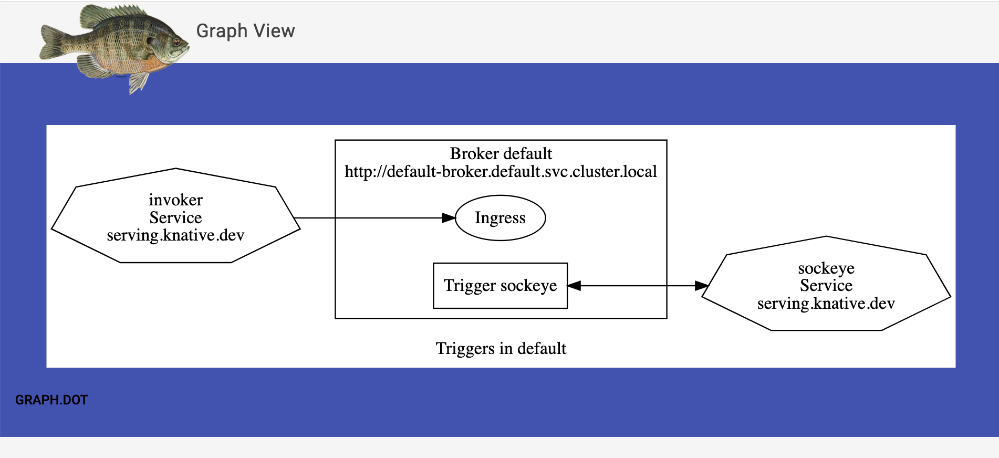

# graph

Visualize your [Knative Eventing](http://github.com/knative/eventing)
connections.



## Usage

Visit the root of the graph service in a web browser. This will show you the
graph of the current Knative resources in the namespace the graph resource is
installed.

# Deploying

## From Release v0.6 >= Knative 0.15

To install into the `default` namespace,

```shell
kubectl apply -f https://github.com/n3wscott/graph/releases/download/v0.6.6/release.yaml
```

To install into a `test` namespace,

```shell
export NAMESPACE=test # <-- update test to your target namespace.
curl -L https://github.com/n3wscott/graph/releases/download/v0.6.6/release.yaml \
  | sed "s/default/${NAMESPACE}/" \
  | kubectl apply -n $NAMESPACE --filename -
```

_NOTE_: This is required because of the ServiceAccount and ClusterBindings required for Graph.

## From Source

To install into the `default` namespace,

```shell
ko apply -f config
```

To install into a `test` namespace,

```shell
export NAMESPACE=test # <-- update test to your target namespace.
ko resolve -f config \
  | sed "s/default/${NAMESPACE}/" \
  | kubectl apply -n $NAMESPACE --filename -
```


### TODO:

- [ ] Get Deployments working when broker is the sink.
- [ ] Work with owner ref graphs.
- [ ] Have Graph take a namespace param.
- [ ] Make Graph work well on namespaced clusters (mt-clusters)